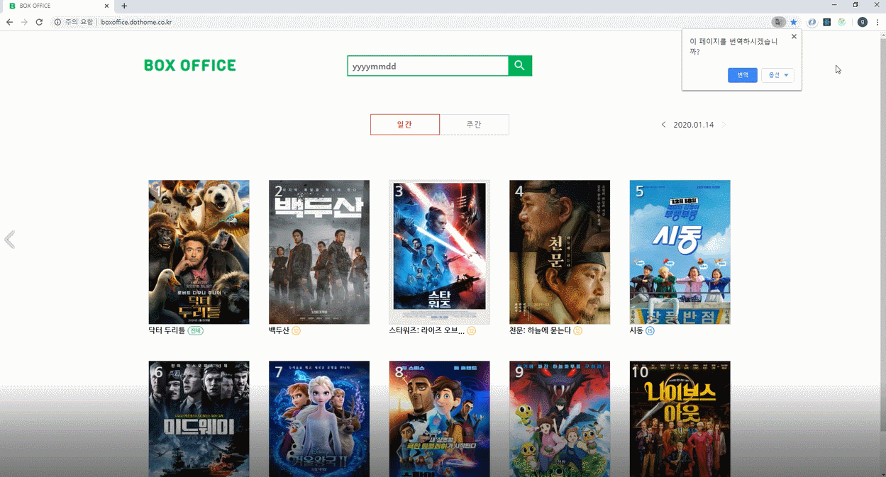
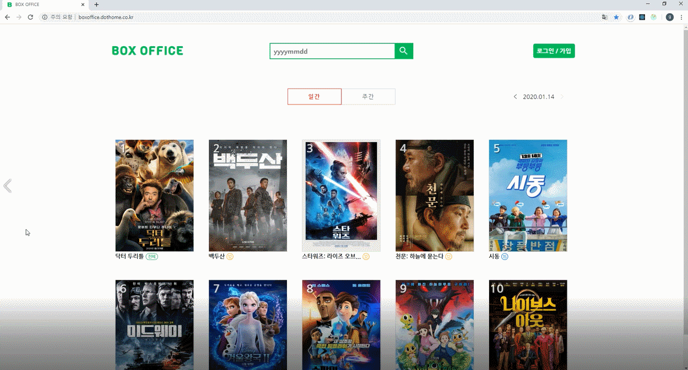
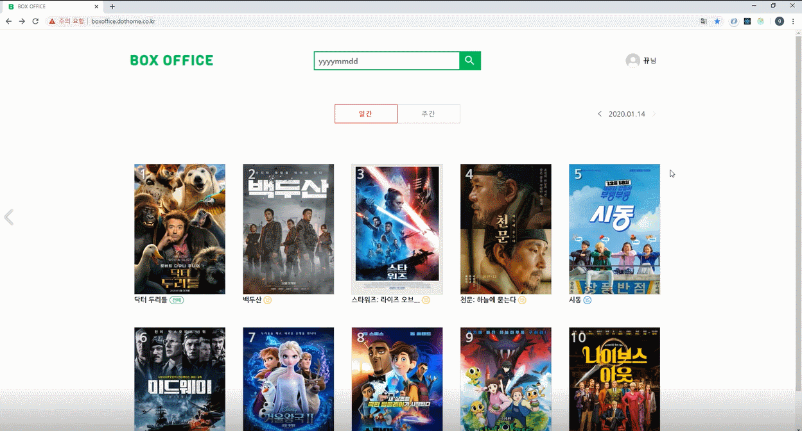

# BOX OFFICE

http://boxoffice.dothome.co.kr/
(현재 크롬에서 지원 중입니다.)

## About

특정 날짜를 입력하여 검색하면 해당 일자의 박스오피스 정보를 제공합니다.
기본 페이지는 어제 일자 기준 정보입니다.

## Features

### MovieList Page

- 기준 일자의 박스오피스 일간 / 주간 정보 제공.
- 날짜 이동 아이콘을 통해 간편하게 전날 또는 다음날 조회.
- 특정 날짜를 이용하여 박스오피스 검색 가능.
- 특정 날짜로 조회 시, axios를 사용하여 API에 데이터 요청.

### Movie Page

- Firebase에 저장 된 데이터를 통하여, 영화 별 상세 정보 제공.
- 댓글 입력 및 삭제, 보고싶어요 기능 제공.

### User Page

- 서브 라우터를 사용하여, 계정 / 영화 평가 / 보고싶어요 메뉴 생성.
- 사용자 계정에서 닉네임 변경, 영화 평가 초기화, 로그아웃, 탈퇴 기능 제공.
- 평가한 영화와 보고싶어요를 클릭한 영화의 목록을 각각 메뉴에서 제공.

### Login Page

- 구글 / 카카오 계정을 이용하여, 회원가입 및 로그인.

## Project Stack

- react
- react-dom
- react-router-dom
- react-redux
- redux
- redux-logger
- redux-thunk
- redux-devtools-extension
- react-kakao-login
- react-google-login
- react-icons
- axios
- firebase
- moment
- styled-components
